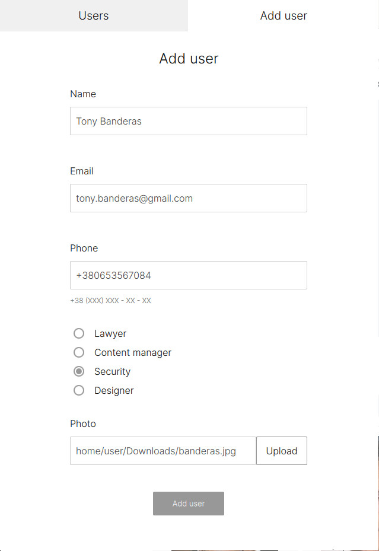
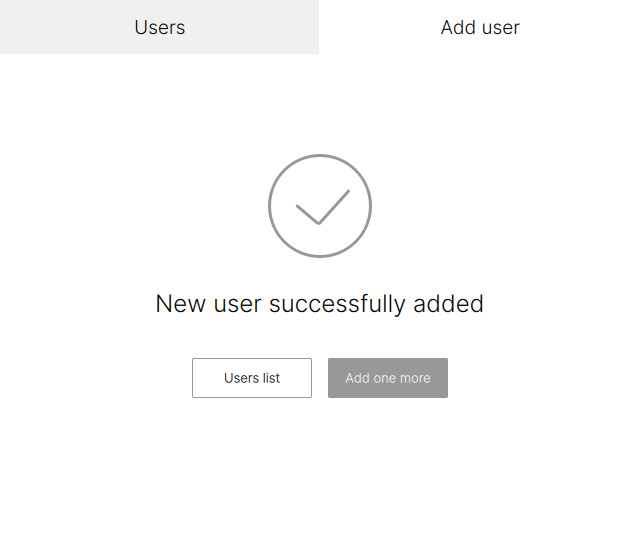
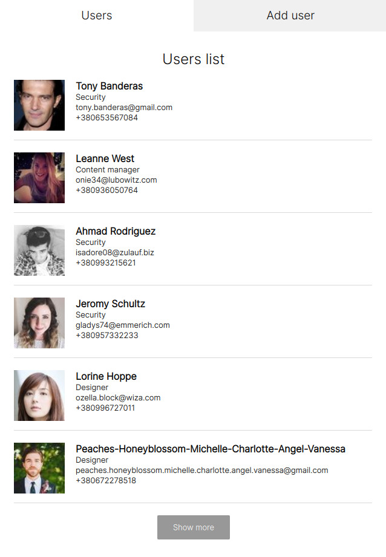

# Test assignment on REST API topic for IT company...

## Assignment requirements

- Develop a simple EXE (C++, Windows 10 support) to demonstrate your client/server development skills.
- Develop UI according to Figma sketches.
- Use REST API (GET/POST) provided by documentation.
- Display 6 users on the API request result page. "Show more" button should be hidden when the last page of API query results is reached.
- Use the GET positions method from the API documentation to dsplay radio buttons on the registration form.
- After successful registration, update the list of users.

## Build requirements

 
### Windows

    Build project with "Desktop Qt 6.6.3 MSVC2019 64bit" kit.
    
1. Install openSSL
```
# Open Windows Terminal with admin privileges
winget search openssl
winget install --id=FireDaemon.OpenSSL -e
$Env:PATH += ";C:\Program Files\FireDaemon OpenSSL 3\bin"
setx /M OPENSSL_ROOT_DIR "C:\Program Files\FireDaemon OpenSSL 3"
```

2. Install Vulkan
```
# Open Windows Terminal  
winget search vulkan
winget install --id=KhronosGroup.VulkanSDK -e
$Env:PATH += ";C:\Program Files\FireDaemon OpenSSL 3\bin"
```

### Android   

    Build project with "Android Qt 6.6.3 Clang arm64-v8a" kit.

1. Install JDK
```
# Open Windows Terminal
winget search jdk
winget install --id=Oracle.JDK.17 -e
```

2. Install NDK 25.2
```
# Open Windows Terminal
cd ~\Downloads
Invoke-WebRequest -Uri "https://dl.google.com/android/repository/android-ndk-r25c-windows.zip" -OutFile "android-ndk-r25c-windows.zip"
Expand-Archive -Path "android-ndk-r25c-windows.zip" -DestinationPath "."
cd android-ndk-r25c
```

3. Generate certificate for apk sign in Projects->Build Android APK (if needed).

## Results

Developed an app that complies with requirements and can be compiled on both Windows and Linux.

#### Screenshots:

<div style="display: flex; justify-content: center;"> 
  
  
  
</div>


